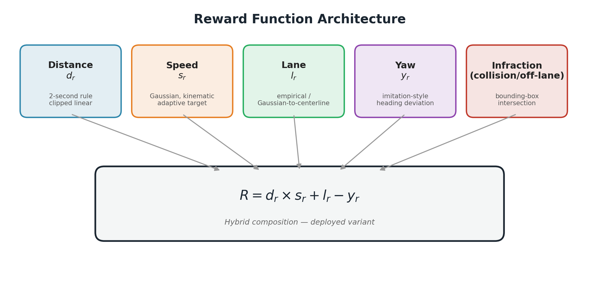
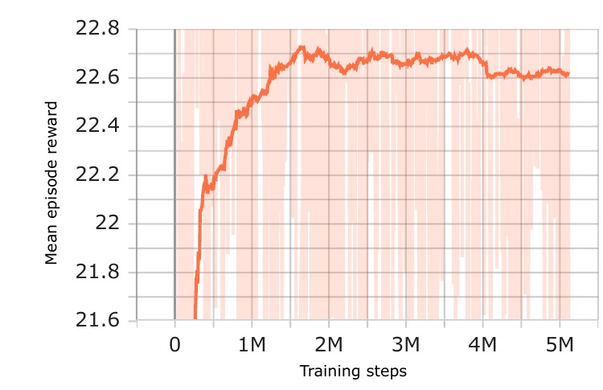
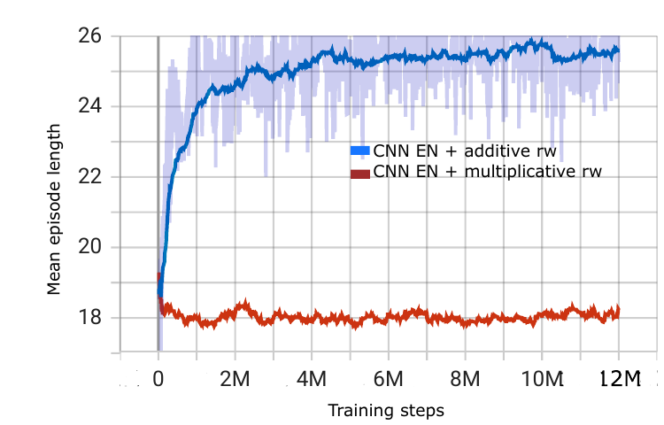
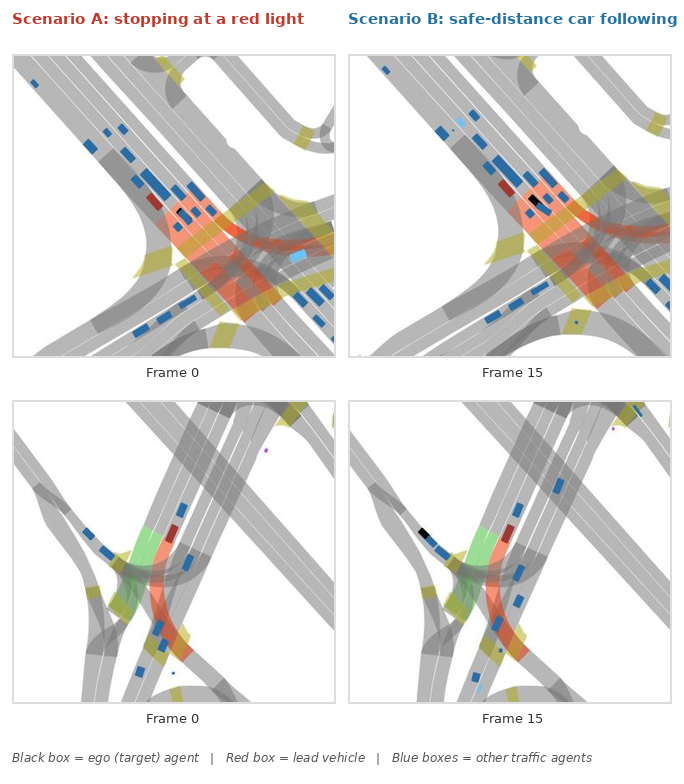

# Rule-Based Reward Shaping for Safe Autonomous Driving

**Designing interpretable, physics-grounded reward functions for RL-based driving policies**

   

---

## Why this project exists

Most RL driving agents are only as safe as the reward signal that trains them. Black-box or purely learned reward models are hard to audit, hard to debug, and hard to trust in a safety-critical domain. This project takes the opposite bet: **can we hand-design a reward function that is fully interpretable, grounded in real driving rules (2-second following rule, posted speed limits, lane geometry), and still trains a competitive PPO policy?**

The answer, benchmarked against a published reward baseline, was yes — **collision rate dropped from 60% → 21%** and **speed-tracking error dropped 5x (11.2 m/s → 2.2 m/s)**. The rest of this README walks through how.

---

## The Reward Function — the core contribution

The reward is decomposed into five independently-interpretable components, each grounded in a real driving heuristic rather than learned from data:

### 1. Distance reward — the 2-second rule

$$d_r = \min\left(\frac{d}{d_s},\ 1\right), \qquad d_s = v \times 2$$

Where `d` is the actual distance to the lead vehicle and `d_s` is the safe distance implied by the 2-second following rule. Clipping at 1 means the agent is never rewarded for hanging back further than necessary — it's incentivized to close unsafe gaps, not to maximize distance.

### 2. Speed reward — Gaussian, with a *kinematically-derived* target

$$s_r = e^{-\frac{(s_c - s_T)^2}{h}}$$

The interesting part isn't the Gaussian shape — it's how the target speed `s_T` is computed. When there's no obstacle, `s_T` is simply the lane's posted limit. But when a red light or stopped vehicle is ahead, the target speed is derived frame-by-frame from the **equations of motion**:

$$\text{acc} = -\frac{v_t^2}{2 \cdot d_o}, \qquad s_T = v_t - \frac{v_t^2}{2 \cdot d_o} \times 0.1$$

This gives the agent a physically realistic deceleration profile toward a stop — not an arbitrary penalty for "going too fast near a red light."

### 3. Lane reward — two formulations, both implemented

- **Empirical (discrete):** `l_r = L` if in a designated lane, `P` (large negative) otherwise.
- **Distance-based (continuous, bell-shaped):**

$$l_r = e^{-\frac{d_t^2}{2\zeta^2}}$$

where `d_t` is perpendicular distance to the lane centerline — reward peaks at 1 when perfectly centered and decays smoothly with lateral drift.

### 4. Yaw reward — imitation-flavored heading alignment

$$z_r = -\,|z_{t+1} - z_{gt}|$$

Penalizes heading deviation from the ground-truth trajectory, without overriding the rule-based objectives above it.

### 5. Infraction — hard constraint on safety

$$
ir =
\begin{cases}
1, & \text{if } b_{ta} \cap b_i \neq \emptyset \text{ (collision) or } l_{ta} \notin l_{desig} \\
0, & \text{otherwise}
\end{cases}
$$

Computed via real-time bounding-box intersection and dynamic designated-lane lookup from map topology.

---

## Three ways to combine five components — and why it matters

A reward function isn't just its components — it's how they're *composed*. This project treated composition strategy itself as an experimental variable, benchmarking three formulations head-to-head:

| Strategy | Formula | Idea |
|---|---|---|
| **Additive** | $R = d_r + s_r + l_r \ (\text{or } -P \text{ if infraction})$ | Each objective contributes independently |
| **Multiplicative** | $R = d_r \times s_r \ (\text{or } -(d_r \times s_r) \text{ if infraction})$ | All objectives must be jointly satisfied |
| **Hybrid** *(deployed)* | $R = d_r \times s_r + l_r - z_r$ | Distance & speed are coupled; lane & yaw contribute independently |

The hybrid formulation is the one that shipped — the multiplicative-only version, while theoretically appealing, turned out to have a real training pathology (see below).

---

## Results

### Training converges to a stable, safe-driving policy

Over 5M training steps, the safe-distance ratio improved from **0.79 → 0.96** and off-road incidents dropped from **15% → 0%**.

### Diagnosing a real reward-shaping failure mode

Multiplying distance and speed rewards sounds like a clean way to enforce "be safe *and* be efficient at once" — but in practice it amplifies variance whenever either term dips:

The additive formulation sustained **~7.5 more collision-free timesteps per episode on average**, and trained with visibly lower variance. This finding directly motivated the hybrid design above — keep the multiplicative coupling only where it's genuinely wanted (distance × speed), and decouple everything else.

### Beating a published baseline

| Metric | This work (Hybrid + CNN encoder) | Published baseline reward |
|---|---|---|
| Collision rate | **21%** | 60% |
| Off-road rate | **6%** | 18% |
| Speed error | **2.2 m/s** (~8 km/h) | 11.2 m/s |

*(100 test episodes, diverse traffic scenarios, identical PPO hyperparameters and encoder.)*

### What the policy actually learned

Two representative rollouts: the agent (black box) correctly slows and stops at a red light before a crosswalk (left), and independently learns to approach and hold a safe following gap behind a stopped lead vehicle (right) — both emergent from the reward design above, with no explicit "stop at red light" rule hard-coded into the policy itself.

---

## System integration

The reward function isn't a standalone script — it's wired into a full closed-loop RL training system:

- **Custom Gym environment** wrapping L5Kit's closed-loop simulator, with a rebuilt multi-modal observation space (agent state, neighbor polylines, lane geometry, crosswalks) and rebuilt `reset`/`step`/`_get_obs` logic.
- **Map-topology reasoning layer**: Ray Casting-based lane assignment, multi-stage neighbor-vehicle filtering (direction → lane membership → nearest-neighbor), and dynamic designated-lane detection — all built on top of raw protobuf semantic map data.
- **PPO training loop** (Stable-Baselines3) with a custom CNN/graph-attention feature extractor, evaluated across 5M–12M training steps and 100+ test episodes per configuration.

---

## Tech stack

`Python` · `PyTorch` · `Stable-Baselines3 (PPO)` · `L5Kit` · `Shapely` (geometric reasoning) · `OpenAI Gym` · `NumPy`

---

## Full write-up

The complete design rationale, derivations, and experimental results (including ablations across state encoders and traffic-density regimes) are documented in the full thesis — linked here / available on request.

